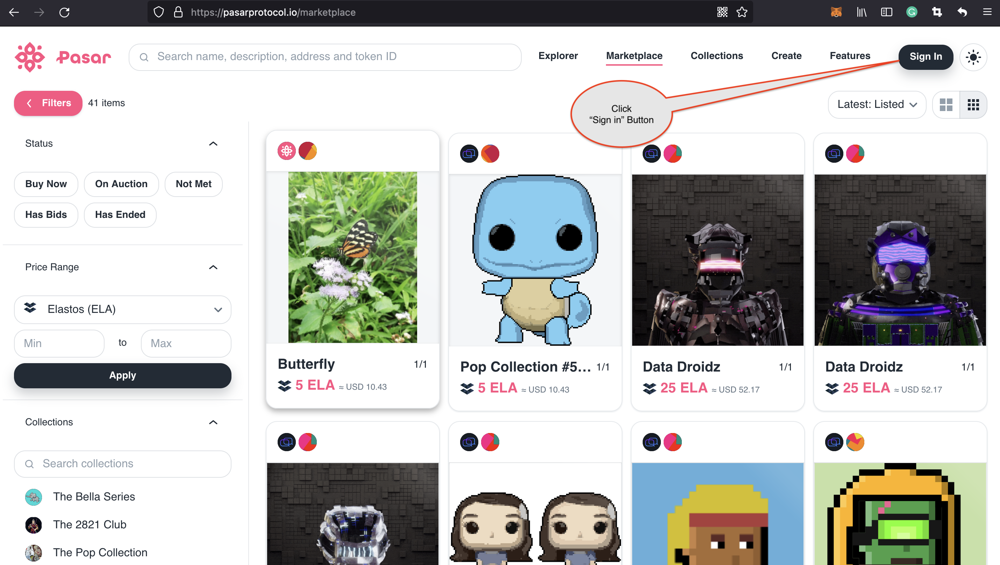
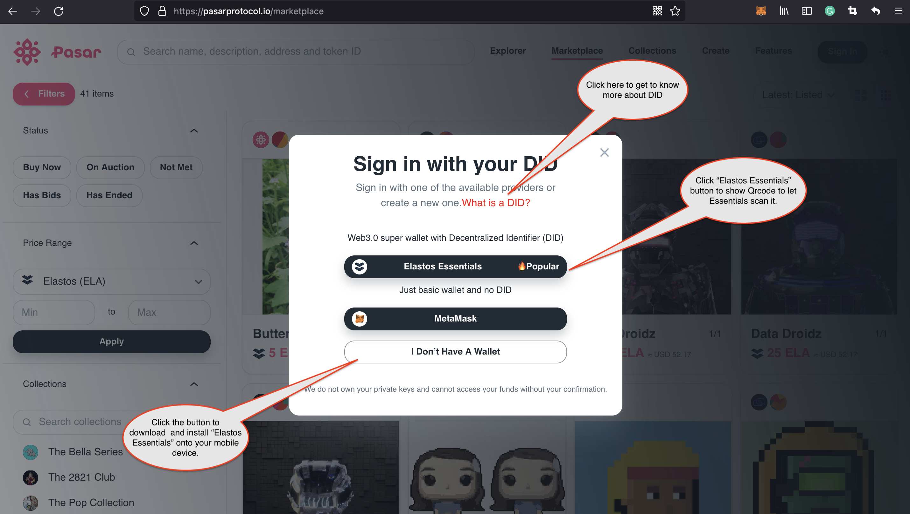

# Desktop

## Open Pasar from desktop browser

When users open [Pasar website ](https://pasarprotocol.io)from your desktop browser, you will see "Sigin-in" button on top-right corner.&#x20;

## Click "Sign in" to show Qrcode

Once you clicked the button "Sign in", a guidance menu prompts up and users need to click button "Elastos Essentials" to show a QRcode if the Essentials application already installed on your mobile device.&#x20;

New users also can click "What is a DID" to get know more about DIDs and then try to install Elastos Essentials wallet by clicking the button "I don't Have A wallet", which guides you to download and install the Essentials application from Google play or Apple Store.
