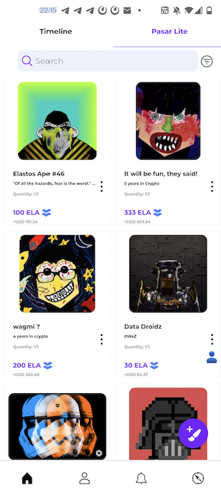

# Pasar history

## A project derived from Feeds

Pasar Decentralised Marketplace (DeMKT) started as part of the Feeds mobile application, and was presented as an attractive feature for users to mint and trade NFTs on ESC. It was the very first NFT collection and marketplace on the Elastos ecosystem.&#x20;

When the NFT features in Feeds became popular, and since it's a standalone feature From Feeds, a proposal has been made for funding from the Cyber Republic (Elastos DAO) to launch the Pasar web application, therefore Pasar became a standalone branding project, and is officially independent of Feeds.&#x20;

## Three Stages of its evolution

> Pasar is arguably the first real NFT marketplace on Elastos Smart Chain (ESC). It was initially developed within Feeds due to two main factors. The first was to increase activity on ESC by building a simple NFT marketplace to introduce Feeds through Pasar. As a result, we saw more than 300% growth in new users signing in to Feeds using DIDs accessing the marketplace (data based on Google Play Store installation data).

Pasar project officially began its own journey since the [Pasar proposal](https://www.cyberrepublic.org/proposals/61953f89eb709a00784155ab) was accepted. Three phases with features are clearly listed in verifiable details.&#x20;

### Pasar Explorer

Pasar explorer is the first feature in the proposal we finished. With Pasar explorer, users can browse and explore any NFTs or transactions on the product.  The provenances of all NFTs on Feeds collection and transactions can be easily checked and verified.

### Classic Market

Pasar classic marketplace (V1 market) was available when we finished the second milestone in the proposal, with the features as same as the ones on Feeds mobile application. Users can mint NFTs from Pasar web application, but only support one public collection - Feeds FTSK Sticker. And users can trade NFTs with buyout feature.&#x20;

### Advanced Market

In order to make Pasar a popular advanced marketplace to trade data assets, A list of significant features is contained in the third stage of the proposal:

* Besides one public channel like Feeds collection, users (generally artists) can create their own dedicated collection to hold all their creative NFTs;
* Other than using a native ELA token, users can trade NFTs with other ERC20 tokens, like DIA/GLIDE/ELK/USDC/BUSD, etc;
* Users can mint and list NFTs in batches, which helps users reduce the spending time;
* Advanced auction mechanism supported. Besides basic auction features for sale, sellers can set reserve prices and buyout prices to meet actual demand;
* Simple social network features are integrated via storing and sharing Profile data from Hive/Vault, a new decentralized storage network of hive nodes.
* KYC-ed credentials integrated as a badge to present a better reputation

## Current Stage

Now, Pasar web application is a fully standalone platform project, and it's on the way to being a community-driven project. Pasar team is currently working on PASAR tokenomics solution. With tokenomics integrated, users can earn rewards from trading NFTs on Pasar DeMKT.&#x20;
